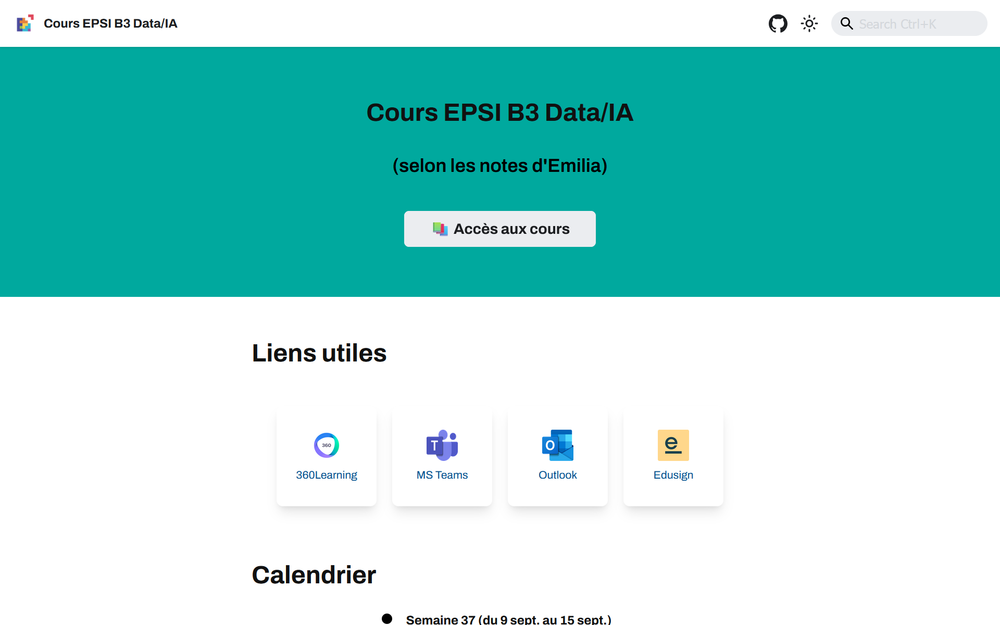

# Website

Ce site à été créé par [Émilia Beguin](https://github.com/BahAilime/) avec [Docusaurus](https://docusaurus.io/) pour gérer les cours de ma classe de B3 Dev DATA/IA à [l'EPSI de Nantes](https://www.epsi.fr/campus/campus-de-nantes/)




## Ajouter des cours

1. **Forkez** ce repo et **clonez-le** sur votre machine :
   ```bash
   git clone https://github.com/[nom d utilisateur]/coursEPSI.git
   ```

2. **Installez les dépendances** avec :
   ```bash
   npm ci
   ```

3. **Ajoutez vos cours** dans le dossier [cours](https://github.com/BahAilime/coursEPSI/tree/main/docs/cours) sous format `.md`, `.mdx`, ou `.jsx`.

5. **Testez localement** :
   ```bash
   npm start
   ```
   
6. **Créez une pull request** pour proposer vos modifications et enrichir les cours communs.
